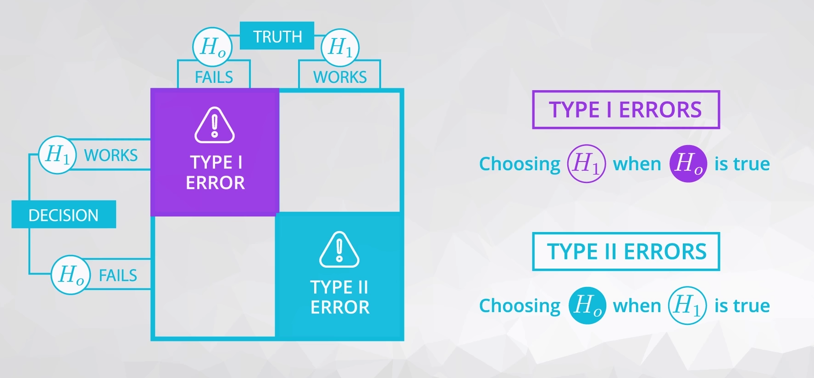
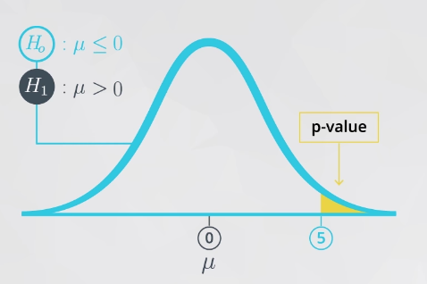
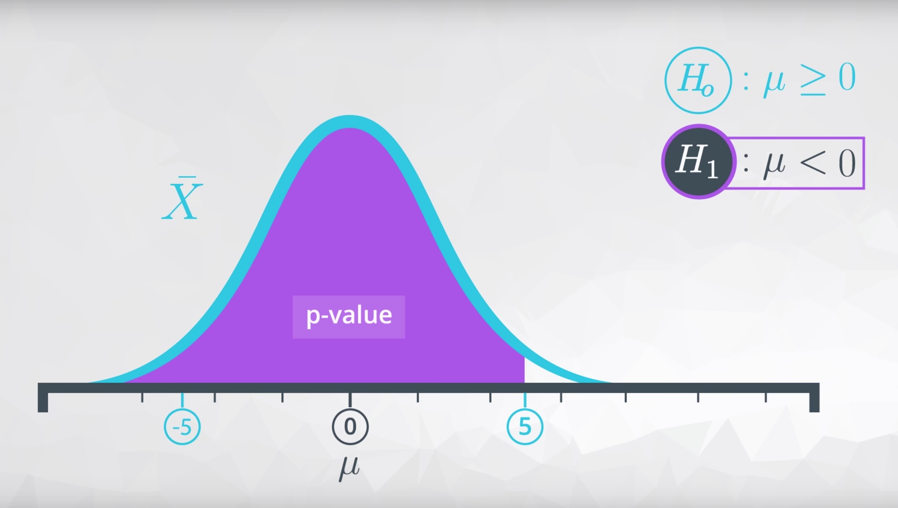

# Descriptive vs. Inferential Statistics

## Variable Types

Either `categorical` or `quantitative`. 

`quantitative` variables as either `continuous` or `discrete`. 

`categorical` variables as either `ordinal` or `nominal`.

## Descriptive Statistics

`Descriptive statistics` **is about describing our collected data** using the measures: measures of center, measures of spread, shape of our distribution, and outliers. We can also use plots of our data to gain a better understanding.

### Quantitative Variables

There are four main aspects used to describe `quantitative` variables:

1. Measures of **Center**
2. Measures of **Spread**
3. **Shape** of the Distribution
4. **Outliers**

#### Measures of Center

Measures of `Center`

1. **Means**
2. **Medians**
3. **Modes**

------

#### Measures of Spread

Measures of `Spread`

1. **Range**
2. **Interquartile Range**
3. **Standard Deviation**
4. **Variance**

------

#### Shape

Distribution of data is frequently associated with one of the three **shapes**:

**1. Right-skewed**

**2. Left-skewed**

**3. Symmetric** (frequently normally distributed)

| **Shape**          | **Mean vs. Median**      | **Real World Applications**                                  |
| ------------------ | ------------------------ | ------------------------------------------------------------ |
| Symmetric (Normal) | Mean equals Median       | Height, Weight, Errors, Precipitation                        |
| Right-skewed       | Mean greater than Median | Amount of drug remaining in a blood stream, Time between phone calls at a call center, Time until light bulb dies |
| Left-skewed        | Mean less than Median    | Grades as a percentage in many universities, Age of death, Asset price changes |

Depending on the shape associated with our dataset, certain measures of center or spread may be better for summarizing our dataset.

When we have data that follows a **normal** distribution, we can completely understand our dataset using the `mean` and `standard deviation`.

However, if our dataset is **skewed**, the `5 number summary` (and measures of center associated with it) might be better to summarize our dataset.

------

#### Outliers

Outliers have a larger influence on measures like the mean than on measures like the median. Work with outliers on a situation by situation basis. Common techniques include:

1. At least note they exist and the impact on summary statistics.
2. If typo - remove or fix
3. Understand why they exist, and the impact on questions we are trying to answer about our data.
4. Reporting the 5 number summary values is often a better indication than measures like the mean and standard deviation when we have outliers.
5. Be careful in reporting. Know how to ask the right questions.

------

#### Histograms and Box Plots

Histograms and box plots to visualize our quantitative data. Identifying outliers and the shape associated with the distribution of our data are easier when using a visual as opposed to using summary statistics.

------

## Inferential Statistics

`Inferential Statistics` **is about using our collected data to draw conclusions to a larger population**. Performing inferential statistics well requires that we take a sample that accurately represents our population of interest.

### Important Distributions

- Binomial: The number of heads/tails in a sequence of coin flips
- Poisson: The hourly number of customers arriving at a bank
- Uniform
- Normal
- Exponential: The length of time between arrivals at a service station

### Sampling Distributions

**sampling distributions** is **the distribution of a statistic**.

For proportions (and also means, as proportions are just the mean of 1 and 0 values), the following characteristics hold.

1. The sampling distribution is centered on the original parameter value.
2. The sampling distribution decreases its variance depending on the sample size used. Specifically, the variance of the sampling distribution is equal to the variance of the original data divided by the sample size used. This is always true for the variance of a sample mean!

In notation, we say if we have a random variable, $\bold{X}$, with variance of $\bold{\sigma^2}$, then the distribution of $\bold{\bar{X}}$ (the sampling distribution of the sample mean) has a variance of $\bold{\frac{\sigma^2}{n}}$.

---

Three of the most common estimation techniques (methods to estimate a population parameter from sample data):

- Maximum Likelihood Estimation
- Method of Moments Estimation
- Bayesian Estimation

---

Two important mathematical theorems for working with sampling distributions include:

1. **Law of Large Numbers**
2. **Central Limit Theorem**

The **Law of Large Numbers** says that **as our sample size increases, the sample mean gets closer to the population mean**.

The **Central Limit Theorem** states that **with a large enough sample size the sampling distribution of the mean will be normally distributed**.

The **Central Limit Theorem** actually applies for these well known statistics:

1. Sample means ($\bar{x}$)
2. Sample proportions ($p$)
3. Difference in sample means ($\bar{x}_1 - \bar{x}_2$)
4. Difference in sample proportions ($p_1 - p_2$)

**but it doesn't apply for all statistics!** 

#### Bootstrapping

- **Bootstrapping** is a technique where we sample from a group with replacement.
- We can use bootstrapping to simulate the creation of sampling distribution, which you did many times in this lesson.
- By bootstrapping and then calculating repeated values of our statistics, we can gain an understanding of the sampling distribution of our statistics.

---

### Confidence Interval

Statistics and their confidence interval can be derived using **traditional methods** and closed -form formulas.

But, using Bootstrapping, you can find a confidence interval using the **sampling distribution** of the statistic that best estimates your parameter of interest.

 You can compute:

1. The confidence interval **width** as the difference between your upper and lower bounds of your confidence interval.
2. The **margin of error** is half the confidence interval width, and the value that you add and subtract from your sample estimate to achieve your confidence interval final results.

You can interpret your confidence interval as **We are 95% confident, the population mean falls between the bounds that you find**.

Assuming you control all other items of your analysis:

1. Increasing your sample size will decrease the width of your confidence interval.
2. Increasing your confidence level (say 95% to 99%) will increase the width of your confidence interval.

Using confidence intervals and hypothesis testing, you are able to provide **statistical significance** in making decisions.

However, it is also important to take into consideration **practical significance** in making decisions.

**Practical significance** takes into consideration other factors of your situation that might not be considered directly in the results of your hypothesis test or confidence interval. Constraints like **space**, **time**, or **money** are important in business decisions. However, they might not be accounted for directly in a statistical test.

---

#### Confidence Intervals (& Hypothesis Testing) vs. Machine Learning

Confidence intervals take an **aggregate** approach towards the conclusions made based on data, as these tests are aimed at understanding population parameters (which are aggregate population values).

Alternatively, machine learning techniques take an individual approach towards making conclusions, as they attempt to predict an outcome for each specific data point.

---

### Hypothesis Testing

To set up hypothesis tests. The null hypothesis $H_{0}$ is what we assume to be true before we collect any data, and the alternative hypothesis $H_{1}$ is usually what we want to try and prove to be true.

You are always performing hypothesis tests on **population parameters**, never on statistics. Statistics are values that you already have from the data, so it does not make sense to perform hypothesis tests on these values.

#### Type I Errors

**Type I errors** have the following features:

1. You should set up your null and alternative hypotheses, so that the worse of your errors is the type I error.
2. They are denoted by the symbol $\alpha$.
3. The definition of a type I error is: **Deciding the alternative ($H_1​$) is true, when actually ($H_0​$) is true.**
4. Type I errors are often called **false positives**.

#### Type II Errors

1. They are denoted by the symbol $\beta$.
2. The definition of a type II error is: **Deciding the null ($H_0$) is true, when actually ($H_1$) is true.**
3. Type II errors are often called **false negatives**.

In the most extreme case, we can always choose one hypothesis (say always choosing the null) to ensure that a particular error never occurs (never a type I error assuming we always choose the null). However, more generally, there is a relationship where with a single set of data decreasing your chance of one type of error, increases the chance of the other error occurring.

##### Parachute Example

This example let you see one of the most extreme cases of errors that might be committed in hypothesis testing. In a type I error an individual died. In a type II error, you lost 30 dollars.

#### Common hypothesis tests

1. Testing a population mean [(One sample t-test)](http://sites.utexas.edu/sos/guided/inferential/numeric/claim/one-sample-t/).
2. Testing the difference in means [(Two sample t-test)](https://www.isixsigma.com/tools-templates/hypothesis-testing/making-sense-two-sample-t-test/)
3. Testing the difference before and after some treatment on the same individual [(Paired t-test)](http://www.statstutor.ac.uk/resources/uploaded/paired-t-test.pdf)
4. Testing a population proportion [(One sample z-test)](http://stattrek.com/statistics/dictionary.aspx?definition=one-sample%20z-test)
5. Testing the difference between population proportions [(Two sample z-test)](https://onlinecourses.science.psu.edu/stat414/node/268)

You can use a t-table or z-table to support one of the above approaches:

- [t-table](https://s3.amazonaws.com/udacity-hosted-downloads/t-table.jpg)
- [t-table or z-table](http://www.z-table.com/t-value-table.html)

**There are literally hundreds of different hypothesis tests!** However, instead of memorizing how to perform all of these tests, you can find the statistic(s) that best estimates the parameter(s) you want to estimate, you can bootstrap to simulate the sampling distribution. Then you can use your sampling distribution to assist in choosing the appropriate hypothesis.

#### P-value

The definition of a p-value is **the probability of observing your (desired) statistic (or one more extreme in favor of the alternative) if the null hypothesis is true**.

The **more extreme in favor of the alternative** portion of this statement determines the shading associated with your p-value.

- If your parameter is greater than some value in the alternative hypothesis, your shading would look like this to obtain your p-value:

  

- If your parameter is less than some value in the alternative hypothesis, your shading would look like this to obtain your p-value:

  

- If your parameter is not equal to some value in the alternative hypothesis, your shading would look like this to obtain your p-value:

  

**Small p-values suggest our null is not true.** Rather, our statistic is likely to have come from a different distribution than the null.

When the p-value is large, we have evidence that our statistic was likely to come from the null hypothesis. Therefore, we do not have evidence to reject the null.

By comparing our p-value to our type I error threshold ($\alpha​$), we can make our decision about which hypothesis we will choose.

$pval \leq \alpha \Rightarrow$ Reject $H_0$

$pval > \alpha \Rightarrow​$ Fail to Reject $H_0​$

The wording used in conclusions of hypothesis testing includes: **We reject the null hypothesis** or **We fail to reject the null hypothesis**. This lends itself to the idea that you start with the null hypothesis true by default, and "choosing" the null at the end of the test would have been the choice even if no data were collected.

**Method:** Similar to confidence intervals (where we could simulate a sampling distribution for a statistic by bootstrapping our sample data), in hypothesis testing, we could simulate a sampling distribution from the null hypothesis using characteristics that would be true if our data were to have come from the null.

1. Simulate a sampling distribution for a statistic
2. Simulate the values of your statistic that are possible from the null.
   1. Simulate what you would expect the sampling distribution to be if the null hypothesis is true. Using **mean** from null and **std** from sampling distribution when normal.
3. Calculate the value of the statistic you actually obtained in your data.
4. Compare your statistic to the values from the null. 
5. Calculate p-value: the proportion of null values that are considered **extreme** based on your alternative.

**NOTE:** When performing more than one hypothesis test, your type I error compounds. In order to correct for this, a common technique is called the **Bonferroni** correction. This correction is **very conservative**, but says that your new type I error rate should be the error rate you actually want divided by the number of tests you are performing.

---

#### Hypothesis Testing vs. Confidence Intervals

Using a confidence interval from the bootstrapping samples, you can essentially make the same decisions as in hypothesis testing (without all of the confusion of p-values).

A two-sided hypothesis test (that is a test involving a $\neq$ in the alternative) is the same in terms of the conclusions made as a confidence interval as long as:

$1 - CI = \alpha$

For example, a 95% confidence interval will draw the same conclusions as a hypothesis test with a type I error rate of 0.05 in terms of which hypothesis to choose, because:

$1 - 0.95 = 0.05$

assuming that the alternative hypothesis is a two sided test.

---

#### Hypothesis Testing vs. Machine Learning

With large sample sizes, hypothesis testing leads to even the smallest of findings as **statistically significant**. However, these findings might not be practically significant at all.

---

## A/B tests

A/B tests are used to test changes on a web page by running an experiment where a **control group** sees the old version, while the **experiment group** sees the new version. A **metric** is then chosen to measure the level of engagement from users in each group.

A/B testing is very much like hypothesis testing with the following hypotheses:

- **Null Hypothesis:** The new version is no better, or even worse, than the old version
- **Alternative Hypothesis:** The new version is better than the old version

If we fail to reject the null hypothesis, the results would suggest keeping the old version. If we reject the null hypothesis, the results would suggest launching the change.

A/B testing also has its drawbacks. It can help you compare two options, but it can't tell you about an option you haven’t considered. It can also produce bias results when tested on existing users:

- **Change Aversion:** Existing users may give an unfair advantage to the old version, simply because they are unhappy with change, even if it’s ultimately for the better.
- **Novelty Effect:** Existing users may give an unfair advantage to the new version, because they’re excited or drawn to the change, even if it is not any better in the long run.

